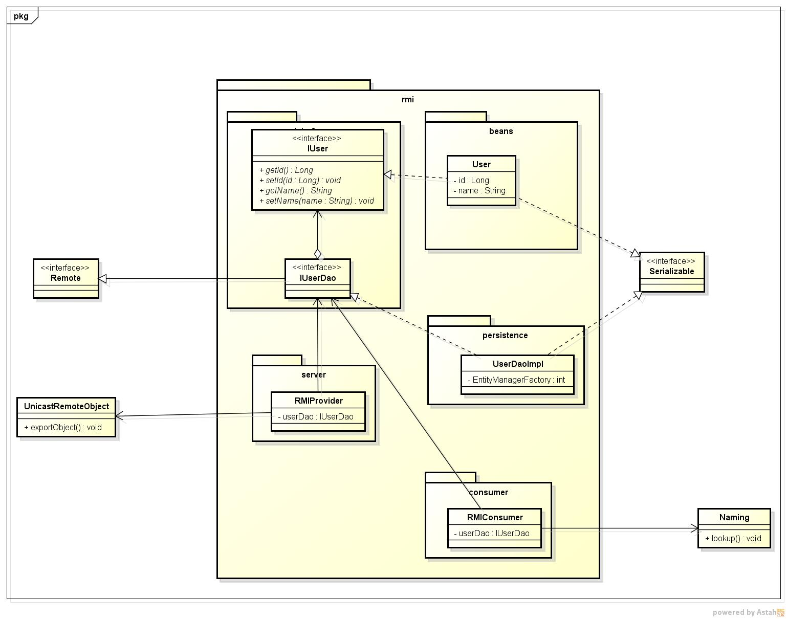

Aplicação com RMI
==============

Apresentação disponível <a href="https://speakerdeck.com/realronchi/rmi-remote-method-invocation" target="_blank">aqui</a>.

Informações disponível <a href="https://github.com/FabricioRonchi/RMI" target="_blank">aqui</a>.

Equipe: Fabrício, João, Emiliano, Everton e Rubens

Programação V

Bacharel em Sistemas de Informação - 5ª Fase

<h3>Modelo UML</h3>

